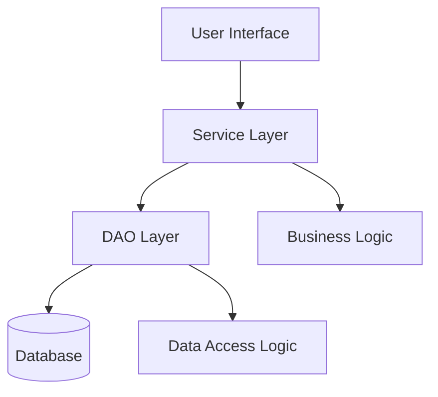
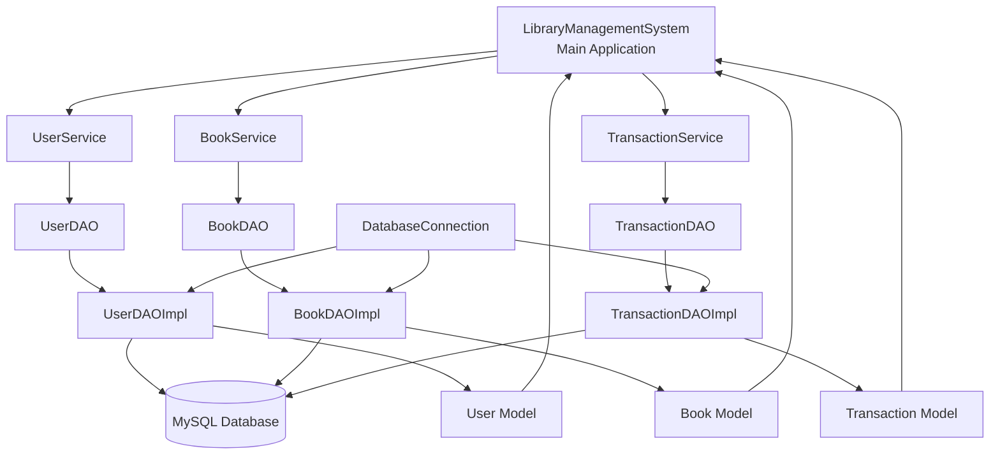

# Library Management System Architecture

## Layered Architecture Diagram



## Detailed Component Diagram



## Package Structure

```
com.library.management
├── LibraryManagementSystem (main)
├── model
│   ├── User
│   ├── Book
│   └── Transaction
├── dao
│   ├── UserDAO
│   ├── BookDAO
│   └── TransactionDAO
├── dao.impl
│   ├── UserDAOImpl
│   ├── BookDAOImpl
│   └── TransactionDAOImpl
├── service
│   ├── UserService
│   ├── BookService
│   └── TransactionService
└── util
    └── DatabaseConnection
```

## Data Flow

1. **User Interface** (Console)
   - Accepts user input
   - Calls appropriate service methods

2. **Service Layer**
   - Implements business logic
   - Validates input
   - Calls DAO methods

3. **DAO Layer**
   - Handles database operations
   - Uses prepared statements for security
   - Returns data to service layer

4. **Database**
   - Stores all persistent data
   - Maintains relationships between entities

## Key Design Principles

### Separation of Concerns
- Each layer has a specific responsibility
- Changes in one layer don't affect others
- Promotes maintainability and testability

### Dependency Injection
- Services depend on DAO interfaces, not implementations
- Allows for easier testing and flexibility

### Single Responsibility Principle
- Each class has one reason to change
- Classes are focused on specific tasks

### Database Abstraction
- DatabaseConnection utility manages connections
- DAO implementations handle all SQL operations
- Services work with domain objects only