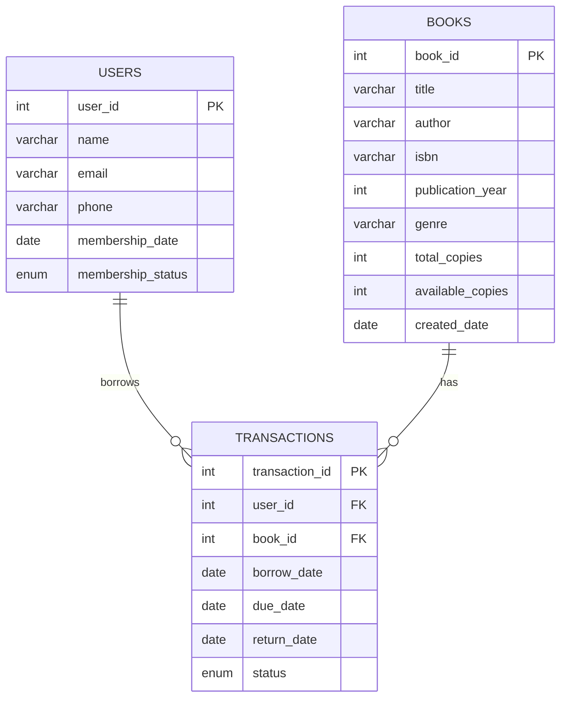

# Database Schema Documentation

## Overview
The Library Management System uses a MySQL database with three main tables that represent the core entities: Users, Books, and Transactions.

## Entity Relationship Diagram



## Table Details

### Users Table
```sql
CREATE TABLE users (
    user_id INT PRIMARY KEY AUTO_INCREMENT,
    name VARCHAR(100) NOT NULL,
    email VARCHAR(100) UNIQUE NOT NULL,
    phone VARCHAR(20),
    membership_date DATE NOT NULL,
    membership_status ENUM('ACTIVE', 'INACTIVE') DEFAULT 'ACTIVE'
);
```

**Columns:**
- `user_id`: Primary key, auto-incrementing identifier
- `name`: User's full name (required)
- `email`: User's email address (required, unique)
- `phone`: User's phone number (optional)
- `membership_date`: Date when user registered
- `membership_status`: Current status (ACTIVE or INACTIVE)

### Books Table
```sql
CREATE TABLE books (
    book_id INT PRIMARY KEY AUTO_INCREMENT,
    title VARCHAR(200) NOT NULL,
    author VARCHAR(100) NOT NULL,
    isbn VARCHAR(20) UNIQUE NOT NULL,
    publication_year YEAR,
    genre VARCHAR(50),
    total_copies INT DEFAULT 1,
    available_copies INT DEFAULT 1,
    created_date DATE NOT NULL
);
```

**Columns:**
- `book_id`: Primary key, auto-incrementing identifier
- `title`: Book title (required)
- `author`: Book author (required)
- `isbn`: International Standard Book Number (required, unique)
- `publication_year`: Year of publication
- `genre`: Category/genre of the book
- `total_copies`: Total number of copies owned by library
- `available_copies`: Number of copies currently available
- `created_date`: Date when book was added to library

### Transactions Table
```sql
CREATE TABLE transactions (
    transaction_id INT PRIMARY KEY AUTO_INCREMENT,
    user_id INT,
    book_id INT,
    borrow_date DATE NOT NULL,
    due_date DATE NOT NULL,
    return_date DATE NULL,
    status ENUM('BORROWED', 'RETURNED', 'OVERDUE') DEFAULT 'BORROWED',
    FOREIGN KEY (user_id) REFERENCES users(user_id),
    FOREIGN KEY (book_id) REFERENCES books(book_id)
);
```

**Columns:**
- `transaction_id`: Primary key, auto-incrementing identifier
- `user_id`: Foreign key referencing users table
- `book_id`: Foreign key referencing books table
- `borrow_date`: Date when book was borrowed
- `due_date`: Date when book is due to be returned
- `return_date`: Date when book was actually returned (nullable)
- `status`: Current status of transaction (BORROWED, RETURNED, or OVERDUE)

## Relationships

1. **One-to-Many**: One user can have many transactions
2. **One-to-Many**: One book can have many transactions
3. **Many-to-Many**: Users and Books are connected through Transactions

## Indexes

- Primary keys on all tables
- Unique constraint on user email
- Unique constraint on book ISBN
- Foreign key constraints on transactions table

## Sample Data

The schema includes sample data for testing:
- 2 sample users: John Doe and Jane Smith
- 3 sample books: The Great Gatsby, To Kill a Mockingbird, and 1984

## Constraints

- All primary keys are auto-incrementing integers
- Email and ISBN fields have unique constraints
- Foreign key constraints ensure referential integrity
- NOT NULL constraints on required fields
- Default values for status fields